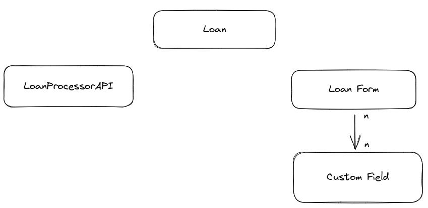

# Loans for Good

### Como rodar o projeto

Execute o comando:
```
docker-compose up
```

### Como acessar os micro-serviços

- Django Admin: `http://localhost:9000/admin/`
- Front-end: `http://localhost:3000`

### Credenciais de acesso
- Django Admin:
```
usuário: admin
password: admin
```

### Modelagem da aplicação



#### - Custom Field:
Representa campos adicionais que podem vir a ser selecionados para um formulário.

#### - Loan Form:
Representa os formulários que o usuário pode preencher. Podem ou não conter campos adicionais.

#### - Loan:
Reprensenta o empréstimo com todos os dados preenchidos pelo o usuário. 
O atributo `status` é preenchido e definido através de uma consulta na API:
 
https://loan-processor.digitalsys.com.br/api/v1/loan/

#### - LoanProcessorApi
Representa a API de consulta para definir o status de um empréstimo.
Caso fosse necessário alterar a API, o código lidaria com isto dinâmicamente.